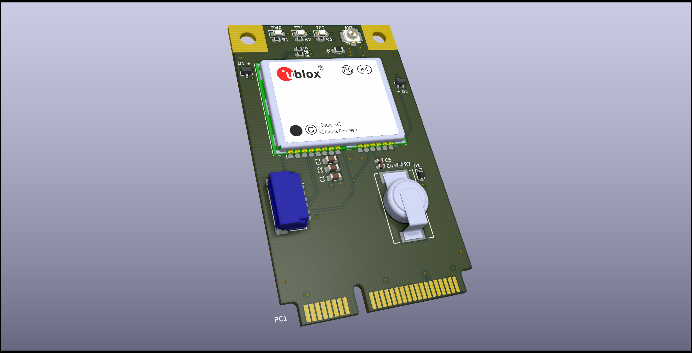

# mPCIe-LEA-M8T

This is a little miniPCIe card I designed to hold a [u-blox LEA-M8T](https://www.u-blox.com/en/product/neolea-m8t-series) GNSS module, with an IO header and an optional backup supercap.
The IO header has both timepulse outputs, as well as UART TX/RX. Module USB is connected to miniPCIe USB. I have not included a way to switch from UART to SPI.

I had this made by [JLCPCB](https://jlcpcb.com) using their 1mm thick PCBs, and elected to get them to assemble most of it - while all of the parts except the supercapacitor, connectors, and GNSS module are in their extended part library, it didn't make sense to spend $6 on extended part fees for two assembled boards, so I skipped the transistors and diode.

## Repository Structure
- `mPCIe-GNSS` contains the main schematics and board drawing
- `mPCIe-GNSS/mPCIe-GNSS.pretty` contains the board-specific footprints
- `mPCIe-GNSS/mPCIe-GNSS-archive.lib` contains the board-specific symbols

## Building
Simply call `make` in the top-top level directory. The `build` directory will
them contain:

- the main mPCIe board
- A panelized version of said board
- zipped gerbers for the boards you can directly use for manufacturing
- zipped gerbers and SMT assembly BOM/position files for JLCPCB's SMT assembly service for the single-board version.

Makefile uses [Jan Mrázek](https://github.com/yaqwsx)'s [KiKit](https://github.com/yaqwsx/KiKit), which I cannot recommend enough, and therefore has to be available on your system.

Jan's [jlcparts](https://yaqwsx.github.io/jlcparts/) app was also extremely useful in narrowing down part choices based on what JLCPCB have available.

-----
### **IMPORTANT NOTE:** If you give JLCPCB these files as-is, *please* verify the orientation of every part before submitting.
Furthermore, while I have received a run of these from JLCPCB, but I appear to have killed my LEA-M8T while 'recovering' it from a chunk of PCB, so **I can't verify that they *actually work***. Will update this if that changes.
